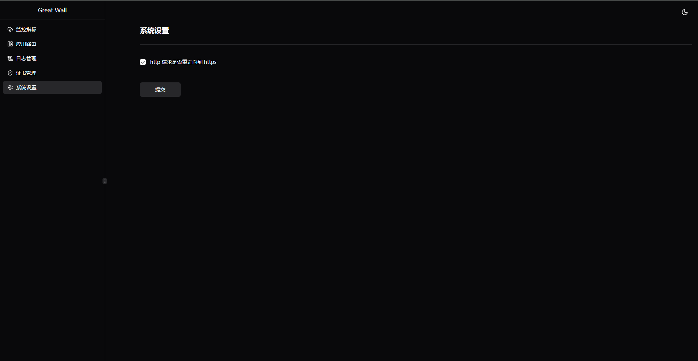

# Great Wall

> 基于 springboot3 + kotlin + graalvm21 构建的网关服务，使用个人使用

## 说明

### 特性

* 完善的页面路由配置
* 丰富的路由插件
* 监控 + 日志一应俱全
* 支持自定义证书 和 [来此加密](https://letsencrypt.osfipin.com/) 证书自动续签
* 使用 graalvm 本地化构建，资源占有率极低，内存稳定在 200MB 以下

### 局限

目前网关存储使用内存数据 `h2` 的本地文件模式，如果在`k8s`中使用请使用有状态服务并且将容器目录 `/workspace/data` 挂载出来，使用 `h2` 的缺陷也很明显，就是不支持集群模式，在后续的迭代中将使用其他中间件存储以支持网关的集群模式。

## 使用

使用以下任意一种方式启动服务后，打开浏览器输入 [http://127.0.0.1:8080](http://127.0.0.1:8080)，默认管理员账号为 `admin` 默认密码为 `123456789`，**建议生产中通过环境变量 `ADMIN_PASSWORD` 修改管理员密码**

### docker

```bash
// 非本地化运行
docker run -d -p 8080:8080 -p 443:443 -p 80:80 --name great-wall moailaozi/great-wall:2.28_bootJar

// 本地化运行，使用 serial gc(串行垃圾回收器)，适合小内存应用
docker run -d -p 8080:8080 -p 443:443 -p 80:80 --name great-wall moailaozi/great-wall:2.28

// 本地化运行，使用 g1 gc(G1 垃圾回收器)，适合大内存高吞吐低延迟的应用
docker run -d -p 8080:8080 -p 443:443 -p 80:80 --name great-wall moailaozi/great-wall:2.28_g1gc
```

### 本地编译

项目基于 gradle，可以使用 `gradle clean nativeCompile` 命令进行本地化编译

### 服务配置

当前服务支持的环境变量配置一览

| 名称                                      | 说明                                                         |
| ----------------------------------------- | ------------------------------------------------------------ |
| TLS_PORT                                  | 证书绑定的端口，默认为 443                                   |
| PORT                                      | 非证书绑定端口，默认为 80                                    |
| CONFIG_SERVER_PORT                        | 后台管理页面端口，默认为 8080                                |
| WEBSOCKET_MAX_FRAME_PAYLOAD_LENGTH        | 代理 websockt 最大帧数字节长度，默认为 6553500               |
| HTTPCLIENT_POOL_MAX_IDLE_TIME             | http 链接最大空闲时间，默认60S                               |
| HTTPCLIENT_POOL_MAX_LIFE_TIME             | http 链接最大存活时间，默认10H                               |
| HTTPCLIENT_POOL_EVICTION_INTERVAL         | http 链接存货检测时间间隔，默认 10S                          |
| ADMIN_PASSWORD                            | 管理员密码配置，**强烈建议：生产环境进行必要的修改**         |
| GREAT_WALL_MAX_MEMORY                     | 配置java最大堆内存，默认为200m，g1gc下默认为1g               |
| MAIN_SERVER_IO_SELECT_COUNT               | 选择器线程数，默认为1，用于接受请求                          |
| MAIN_SERVER_IO_WORK_COUNT                 | 工作线程数，默认为当前处理器内核数量，最小值为4，用于处理请求 |
| HTTPCLIENT_SSL_USE_INSECURE_TRUST_MANAGER | 是否信任所有客户端证书                                       |
| HTTPCLIENT_CONNECT_TIMEOUT                | 客户端请求超时时间，单位毫秒，默认值 3000                    |
| HTTP_2_ENABLED                            | 是否启用Http2，默认值为 true 开启                            |

## 规划

- [x] 路由支持插件配置
- [ ] 防火墙相关功能
- [ ] 支持一些服务发现插件，进行动态刷新路由
- [ ] 支持集群模式

## 系统截图




## 使用技术

本项目使用了以下语言或框架，感谢开源

* [SpringBoot3 + SpringCloudGateway](https://spring.io/projects/spring-cloud-gateway)
* [kotlin](https://book.kotlincn.net/text/getting-started.html)
* [react](https://zh-hans.react.dev/learn)
* [shadcn ui](https://ui.shadcn.com/)
* [type script](https://www.tslang.cn/)
* [graalvm](https://www.graalvm.org/)
* [gradle](https://gradle.org/)
* [vite](https://vitejs.cn/vite3-cn/guide/)
* 等等….

